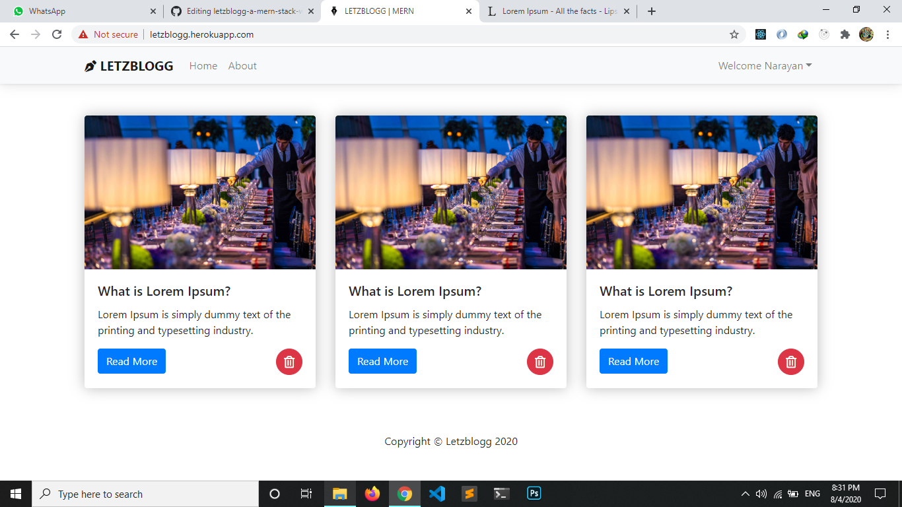

# letzblogg-a-mern-stack-web-app
This is a MERN stack blog web app where a user can read blogs and need to register to post some

Demo: letzblogg.herokuapp.com/ (Used static image)

updated (Branch V2): https://letzblogg-v2.herokuapp.com/ (Image upload not working because heroku doesn't allow to store dynamic files)

